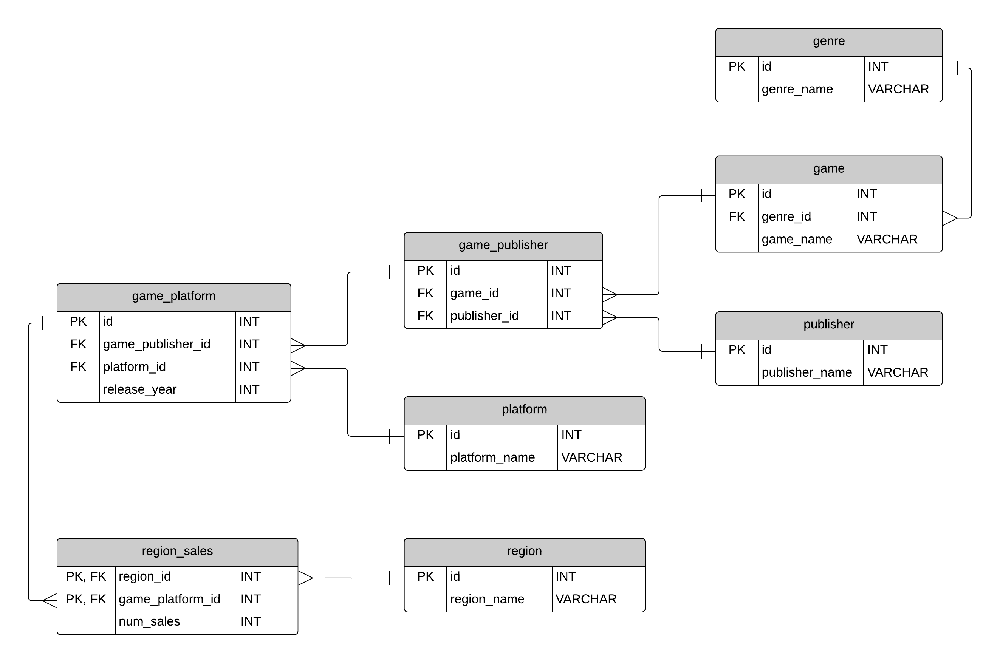

# REST API

VideoGame API для управления игровым каталогом и аналитики продаж 🎮.

## Технический стек

**Backend:**
- Java 24
- Spring Boot 3.5.0
  - Spring Web MVC (REST API)
  - Spring Data JPA (Hibernate)
  - Spring Security (JWT аутентификация)
  - Spring Cache (Caffeine)
  - Spring Validation (валидация DTO)

**База данных:**
- PostgreSQL
- Liquibase (миграции)

**Документация:**
- OpenAPI 3.0 (SpringDoc)

**Утилиты:**
- Lombok
- Nimbus JOSE/JWT (JWT токены)

**Тестирование:**
- Spring Test
- Testcontainers (PostgreSQL)

**Инфраструктура:**
- Docker (контейнеризация приложения)

**Запуск:**
mvn spring-boot:run

## 🔍 Описание
REST API предоставляет полный цикл управления игровыми данными:

### Каталогизация:

a) Игр (Game)

b) Платформ (Platform)

c) Издателей (Publisher)

d) Жанров (Genre)

e) Регионов (Region)

### Управление связями:

a) Игра-Издатель (GamePublisher)

b) Игра-Платформа (GamePlatform)

c) Региональные продажи (RegionSales)

### Аналитика:

a) Анализ региональных продаж с привязкой к связям Игра-Платформа

b) Статистика по выпускам игр по годам

## Безопасность:

a) Ролевая модель (Admin/User)

b) JWT-аутентификация

### Производительность:

a) Кэширование часто запрашиваемых данных

b) Пагинация результатов

## Схема данных

## 📚 Содержание

1. Идентификация и авторизация

2. Управление играми (GamePlatform)

3. Аналитика продаж

4. Администрирование

5. Вспомогательные запросы

6. Технические детали

# Идентификация и авторизация 🔐
## Регистрация

### Request

`POST /games/api/register`

    curl -i -X "POST" 
    "http://localhost:8081/games/api/register" 
    -H "accept: application/json" 
    -H "Content-Type: application/json" 
    -d "{ \"username\": \"newUser1\", 
    \"password\": \"password2\"
    }" 

### Response

    HTTP/1.1 201
    X-Content-Type-Options: nosniff
    X-XSS-Protection: 0
    Cache-Control: no-cache, no-store, max-age=0, must-revalidate
    Pragma: no-cache
    Expires: 0
    X-Frame-Options: DENY
    Content-Length: 0
    Date: Mon, 07 Jul 2025 13:16:33 GMT

## Аутентификация и авторизация

### Request

`POST /games/api/login`

    curl -i -X "POST" 
    "http://localhost:8081/games/api/login" 
    -H "accept: application/json" 
    -H "Content-Type: application/json" 
    -d "{ \"username\": \"newUser1\", 
    \"password\": \"password2\"
    }" 

### Response

    HTTP/1.1 200
    Set-Cookie: auth-token=JWT_TOKEN; Max-Age=86399; Expires=Tue, 08 Jul 2025 13:19:16 GMT; Path=/; HttpOnly
    X-Content-Type-Options: nosniff
    X-XSS-Protection: 0
    Cache-Control: no-cache, no-store, max-age=0, must-revalidate
    Pragma: no-cache
    Expires: 0
    X-Frame-Options: DENY
    Content-Length: 0
    Date: Mon, 07 Jul 2025 13:19:17 GMT

## Выйти из системы

### Request

`GET /games/api/register`

    curl -i -X "POST" 
    "http://localhost:8081/games/api/logout" 
    -H "accept: application/json"  

### Response

    HTTP/1.1 204
    Set-Cookie: auth-token=; Max-Age=0; Expires=Thu, 01 Jan 1970    00:00:10 GMT; Path=/
    X-Content-Type-Options: nosniff
    X-XSS-Protection: 0
    Cache-Control: no-cache, no-store, max-age=0, must-revalidate
    Pragma: no-cache
    Expires: 0
    X-Frame-Options: DENY
    Date: Mon, 07 Jul 2025 13:27:25 GMT

# Управление играми (GamePlatform)
## Получить полную информацию о всех играх

### Request

`GET games/api/game-platform/all/page`

    curl -i -X "GET" "http://localhost:8081/games/api/game-platform/all/0" -H "accept: application/json" -b "auth-token=JWT_TOKEN"

### Response

    HTTP/1.1 200
    X-Content-Type-Options: nosniff
    X-XSS-Protection: 0
    Cache-Control: no-cache, no-store, max-age=0, must-revalidate
    Pragma: no-cache
    Expires: 0
    X-Frame-Options: DENY
    Content-Type: application/json
    Transfer-Encoding: chunked
    Date: Mon, 07 Jul 2025 10:12:34 GMT
### Example
	{
		"id": 1,
		"gameName": "Panzer Tactics",
		"publisherName": "10TACLE Studios",
		"releaseYear": 2007,
		"platformName": "DS",
		"genreName": "Strategy"
	}
## Получить полную информацию для игры с ID

### Request

`GET games/api/game-platform/id`

    curl -i -X "GET" "http://localhost:8081/games/api/game-platform/2" -H "accept: application/json" -b "auth-token=JWT_TOKEN"

### Response

    HTTP/1.1 200 
    X-Content-Type-Options: nosniff
    X-XSS-Protection: 0
    Cache-Control: no-cache, no-store, max-age=0, must-revalidate
    Pragma: no-cache
    Expires: 0
    X-Frame-Options: DENY
    Content-Type: application/json
    Transfer-Encoding: chunked
    Date: Mon, 07 Jul 2025 10:23:02 GMT

### Example
    {
	"id": 2,
	"gameName": "Boulder Dash: Rocks!",
	"publisherName": "10TACLE Studios",
	"releaseYear": 2007,
	"platformName": "DS",
	"genreName": "Puzzle"
    }

## Добавить новую связь Игра-Платформа(GamePlatform)  (только для админов)

### Request

`POST /games/api/game-platform/add`

    curl -i -X "POST" "http://localhost:8081/games/api/game-platform/add"
    -H "accept: application/json" 
    -H "Content-Type: application/json" 
    -d "{\"gameName\": \"The Witcher 4\", 
    \"publisherName\": \"NoNamePublisher\", 
    \"releaseYear\": 2025, 
    \"platformName\": \"PS4\", 
    \"genreName\": \"Action/RPG\"}" 
    -b "auth-token=JWT_TOKEN"

### Response

    HTTP/1.1 201
    Location: http://localhost:8081/games/api/game-platform/16331
    X-Content-Type-Options: nosniff
    X-XSS-Protection: 0
    Cache-Control: no-cache, no-store, max-age=0, must-revalidate
    Pragma: no-cache
    Expires: 0
    X-Frame-Options: DENY
    Content-Type: application/json
    Transfer-Encoding: chunked
    Date: Mon, 07 Jul 2025 10:37:10 GMT

### Example
    {
    "id": 16331,   
    "gameName": "The Witcher 4",
    "publisherName": "NoNamePublisher",
    "releaseYear": 2025,
    "platformName": "PS4",
    "genreName": "Action/RPG"
    }

## Обновить связь Игра-Платформа(GamePlatform) (только для админов)

### Request

`PUT /games/api/game-platform/update/id`

    curl -i -X "PUT"  
    "http://localhost:8081/games/api/game-platform/update/16330"    
    -H "accept: */*" 
    -H "Content-Type: application/json" 
    -d "{ \"gameName\": \"The Witcher 4\", 
    \"publisherName\": \"NoNamePublisher\", 
    \"releaseYear\": 2025, 
    \"platformName\": \"PS3\"}" 
    -b "auth-token=JWT_TOKEN"

### Response

    HTTP/1.1 204
    X-Content-Type-Options: nosniff
    X-XSS-Protection: 0
    Cache-Control: no-cache, no-store, max-age=0, must-revalidate
    Pragma: no-cache
    Expires: 0
    X-Frame-Options: DENY
    Date: Mon, 07 Jul 2025 10:57:09 GMT

## Удалить связь Игра-Платформа(GamePlatform) (только для админов)

### Request

`DELETE /games/api/game-platform/delete/id`

    curl -i -X "DELETE" 
    "http://localhost:8081/games/api/game-platform/delete/16331" 
    -H "accept: */*" 
    -b "auth-token=JWT_TOKEN"

### Response

    HTTP/1.1 204
    X-Content-Type-Options: nosniff
    X-XSS-Protection: 0
    Cache-Control: no-cache, no-store, max-age=0, must-revalidate
    Pragma: no-cache
    Expires: 0
    X-Frame-Options: DENY
    Date: Mon, 07 Jul 2025 11:02:06 GMT
# Аналитика продаж 📊
## Получить полную информацию о региональных продажах

### Request

`GET /games/api/region-sales/all/page`

    curl -i -X "GET" 
    "http://localhost:8081/games/api/region-sales/all/0" 
    -H "accept: application/json" 
    -b "auth-token=JWT_TOKEN"

### Response

    HTTP/1.1 200
    X-Content-Type-Options: nosniff
    X-XSS-Protection: 0
    Cache-Control: no-cache, no-store, max-age=0, must-revalidate
    Pragma: no-cache
    Expires: 0
    X-Frame-Options: DENY
    Content-Type: application/json
    Transfer-Encoding: chunked
    Date: Mon, 07 Jul 2025 11:46:38 GMT

### Example
    {
    "regionId": 1,
    "gamePlatformId": 2523,
    "numSales": 0.49
    }

## Получить полную информацию о региональных продажах по id региона и id свзи Игра-Платформа(GamePlatform)

### Request

`GET /games/api/region-sales/getById/gamePlatformId/regionId`

    curl -i -X "GET" 
    "http://localhost:8081/games/api/region-sales/getById/2479/1" 
    -H "accept: application/json" 
    -b "auth-token=JWT_TOKEN"

### Response

    HTTP/1.1 200
    X-Content-Type-Options: nosniff
    X-XSS-Protection: 0
    Cache-Control: no-cache, no-store, max-age=0, must-revalidate
    Pragma: no-cache
    Expires: 0
    X-Frame-Options: DENY
    Content-Type: application/json
    Transfer-Encoding: chunked
    Date: Mon, 07 Jul 2025 11:54:11 GMT
    
### Example
    {
    "regionId": 1,
    "gamePlatformId": 2479,
    }

## Создать новую запись о региональных продажах (только для админов)

### Request

`POST /games/api/region-sales/add`

    curl -i -X "POST" 
    "http://localhost:8081/games/api/region-sales/add" 
    -H "accept: application/json" 
    -H "Content-Type: application/json" 
    -d "{ \"regionId\": 2, 
    \"gamePlatformId\": 16330, 
    \"numSales\": 2.4}" 
    -b "auth-token=JWT_TOKEN"

### Response

    HTTP/1.1 201
    Location: http://localhost:8081/region-sales/findById
    X-Content-Type-Options: nosniff
    X-XSS-Protection: 0
    Cache-Control: no-cache, no-store, max-age=0, must-revalidate
    Pragma: no-cache
    Expires: 0
    X-Frame-Options: DENY
    Content-Type: application/json
    Transfer-Encoding: chunked
    Date: Mon, 07 Jul 2025 12:01:29 GMT
    
### Example
    {
    "regionId":2,
    "gamePlatformId":16330,
    "numSales":2.4
    }

## Обновить запись о региональных продажах по id (только для админов)

### Request

`PUT /games/api/region-sales/update`

    curl -i -X "PUT" 
    "http://localhost:8081/games/api/region-sales/update" 
    -H "accept: application/json" 
    -H "Content-Type: application/json" 
    -d "{ \"oldRegionId\": 2, 
    \"oldGamePlatformId\": 16330,
    \"newRegionId\":3,
    \"newGamePlatformId\": 16330,
    \"numSales\": 1.789}" 
    -b "auth-token=JWT_TOKEN"

### Response

    HTTP/1.1 204
    X-Content-Type-Options: nosniff
    X-XSS-Protection: 0
    Cache-Control: no-cache, no-store, max-age=0, must-revalidate
    Pragma: no-cache
    Expires: 0
    X-Frame-Options: DENY
    Date: Mon, 07 Jul 2025 12:23:42 GMT

## Удалить запись о региональных продажах по id (только для админов)

### Request

`DELETE /games/api/region-sales/delete`

    curl -i -X "DELETE" 
    "http://localhost:8081/games/api/region-sales/delete" 
    -H "accept: application/json" 
    -H "Content-Type: application/json" 
    -d "{ \"regionId\": 3, 
    \"gamePlatformId\": 16330
    }" 
    -b "auth-token=JWT_TOKEN"

### Response

    HTTP/1.1 204
    X-Content-Type-Options: nosniff
    X-XSS-Protection: 0
    Cache-Control: no-cache, no-store, max-age=0, must-revalidate
    Pragma: no-cache
    Expires: 0
    X-Frame-Options: DENY
    Date: Mon, 07 Jul 2025 12:32:55 GMT

# Администрирование ⚙️
## Получить список пользователей(только для админов)

### Request

`GET /games/api/change-authority/users/page`

    curl -i -X "GET" "http://localhost:8081/games/api/change-authority/users/0" -H "accept: application/json" -b "auth-token=JWT_TOKEN"  

### Response

    HTTP/1.1 200
    X-Content-Type-Options: nosniff
    X-XSS-Protection: 0
    Cache-Control: no-cache, no-store, max-age=0, must-revalidate
    Pragma: no-cache
    Expires: 0
    X-Frame-Options: DENY
    Content-Type: application/json
    Transfer-Encoding: chunked
    Date: Mon, 07 Jul 2025 13:33:28 GMT
### Example
    {
    "id":1,
    "username":"kirill",
    "authority":"[ROLE_ADMIN]"
    }

## Получить пользователя по id (только для админов)

### Request

`GET /games/api/change-authority/user/id`

    curl -i -X "GET" "http://localhost:8081/games/api/change-authority/user/1" -H "accept: application/json" -b "auth-token=JWT_TOKEN"  

### Response

    HTTP/1.1 200
    X-Content-Type-Options: nosniff
    X-XSS-Protection: 0
    Cache-Control: no-cache, no-store, max-age=0, must-revalidate
    Pragma: no-cache
    Expires: 0
    X-Frame-Options: DENY
    Content-Type: application/json
    Transfer-Encoding: chunked
    Date: Mon, 07 Jul 2025 13:42:14 GMT
### Example
    {
    "id":1,
    "username":"kirill",
    "authority":"[ROLE_ADMIN]"
    }

## Получить текущего пользователя  (только для админов)

### Request

`GET /games/api/change-authority/current-user`

    curl -i -X "GET" "http://localhost:8081/games/api/change-authority/current-user" -H "accept: application/json" -b "auth-token=JWT_TOKEN"  

### Response

    HTTP/1.1 200
    X-Content-Type-Options: nosniff
    X-XSS-Protection: 0
    Cache-Control: no-cache, no-store, max-age=0, must-revalidate
    Pragma: no-cache
    Expires: 0
    X-Frame-Options: DENY
    Content-Type: application/json
    Transfer-Encoding: chunked
    Date: Mon, 07 Jul 2025 13:44:21 GMT
### Example
    {
    "id":1,
    "username":"kirill",
    "authority":"[ROLE_ADMIN]"
    }

## Изменить права пользователя  (только для админов)

### Request

`PUT /games/api/change-authority/id?newAuthority=`

    curl -i -X "PUT" "http://localhost:8081/games/api/change-authority/4?newAuthority=ADMIN" -H "accept: application/json" -b "auth-token=JWT_TOKEN"  

### Response

    HTTP/1.1 204
    X-Content-Type-Options: nosniff
    X-XSS-Protection: 0
    Cache-Control: no-cache, no-store, max-age=0, must-revalidate
    Pragma: no-cache
    Expires: 0
    X-Frame-Options: DENY
    Date: Mon, 07 Jul 2025 13:49:18 GMT
# Вспомогательные функции
### Вспомогательные запросы  для работы с конкретными сущностями
Все сущности entity = (`platform`, `publisher`, `genre`, `region`,`game`) поддерживают стандартный набор операций:

| Метод  | Путь                          | Доступ    | Описание                  |
|--------|-------------------------------|-----------|---------------------------|
| `GET`  | `games/api/{entity}/all/{page}`    | USER    | Постраничный список       |
| `GET`  | `games/api/{entity}/{id}`          | USER    | Получить по ID            |
| `POST` | `games/api/{entity}/create`           | ADMIN     | Добавить                  |
| `PUT`  | `games/api/{entity}/update/{id}`   | ADMIN     | Изменить по ID            |
| `DELETE`| `games/api/{entity}/delete/{id}`  | ADMIN     | Удалить по ID             |

# Пример запросов для game
## Получить список всех игр 

### Request

`GET /games/api/all/page`

    curl -i -X "GET" "http://localhost:8081/games/api/all/0" -H "accept: application/json" -b "auth-token=JWT_TOKEN"  

### Response

    HTTP/1.1 200
    X-Content-Type-Options: nosniff
    X-XSS-Protection: 0
    Cache-Control: no-cache, no-store, max-age=0, must-revalidate
    Pragma: no-cache
    Expires: 0
    X-Frame-Options: DENY
    Content-Type: application/json
    Transfer-Encoding: chunked
    Date: Mon, 07 Jul 2025 18:19:35 GMT
### Example
    {
    "id":1,
    "gameName":"'98 Koshien",
    "genreName":"Sports"
    }

## Получить игру по id 

### Request

`GET /games/api/game/id`

    curl -i -X "GET" "http://localhost:8081/games/api/game/1" -H "accept: application/json" -b "auth-token=JWT_TOKEN"  

### Response

    HTTP/1.1 200
    X-Content-Type-Options: nosniff
    X-XSS-Protection: 0
    Cache-Control: no-cache, no-store, max-age=0, must-revalidate
    Pragma: no-cache
    Expires: 0
    X-Frame-Options: DENY
    Content-Type: application/json
    Transfer-Encoding: chunked
    Date: Mon, 07 Jul 2025 18:22:07 GMT
### Example
    {
    "id":1,
    "gameName":"'98 Koshien",
    "genreName":"Sports"
    }

## Добавить игру (только для админов)

### Request

`POST /games/api/game/create`

    curl -i -X "POST" "http://localhost:8081/games/api/game/create" -H "accept: application/json" -H "Content-Type: application/json" -d "{\"gameName\": \"newGameTest\", \"genreName\": \"Action\"}" -b "auth-token=JWT_TOKEN"  

### Response

    TTP/1.1 201
    Location: http://localhost:8081/games/api/game/11369
    X-Content-Type-Options: nosniff
    X-XSS-Protection: 0
    Cache-Control: no-cache, no-store, max-age=0, must-revalidate
    Pragma: no-cache
    Expires: 0
    X-Frame-Options: DENY
    Content-Type: application/json
    Transfer-Encoding: chunked
    Date: Mon, 07 Jul 2025 18:44:26 GMT
### Example
    {
    "id":11369,
    "gameName":"newGameTest",
    "genreName":"Action"
    }

## Изменить игру (только для админов)

### Request

`POST /games/api/game/create`

    curl -i -X "POST" "http://localhost:8081/games/api/game/update/11369?forceUpdate=false" -H "accept: application/json" -H "Content-Type: application/json" -d "{\"gameName\": \"newGameTest1\", \"genreName\": \"RPG\"}" -b "auth-token=JWT_TOKEN"  

### Response

    HTTP/1.1 204
    X-Content-Type-Options: nosniff
    X-XSS-Protection: 0
    Cache-Control: no-cache, no-store, max-age=0, must-revalidate
    Pragma: no-cache
    Expires: 0
    X-Frame-Options: DENY
    Date: Mon, 07 Jul 2025 18:50:00 GMT

## Удалить игру (только для админов)

### Request

`POST /games/api/game/delete/id`

    curl -i -X "POST" "http://localhost:8081/games/api/game/delete/11369?forceUpdate=false" -H "accept: application/json"  -b "auth-token=JWT_TOKEN"  

### Response

    HTTP/1.1 204
    X-Content-Type-Options: nosniff
    X-XSS-Protection: 0
    Cache-Control: no-cache, no-store, max-age=0, must-revalidate
    Pragma: no-cache
    Expires: 0
    X-Frame-Options: DENY
    Date: Mon, 07 Jul 2025 18:53:15 GMT

## Дополнительные запросы для игр

## Получить список игр по жанру

### Request

`GET /games/api/game/search_by_genre`

    curl -i -X "GET" "http://localhost:8081/games/api/game/search_by_genre?genre=Misc&page=0" -H "accept: application/json"  -b "auth-token=JWT_TOKEN"  

### Response

    HTTP/1.1 200
    X-Content-Type-Options: nosniff
    X-XSS-Protection: 0
    Cache-Control: no-cache, no-store, max-age=0, must-revalidate
    Pragma: no-cache
    Expires: 0
    X-Frame-Options: DENY
    Content-Type: application/json
    Transfer-Encoding: chunked
    Date: Mon, 07 Jul 2025 20:00:05 GMT

### Example
    {
    "id":16,
    "gameName":"1 vs. 100",
    "genreName":"Misc"
    }

## Получить  игру по названию

### Request

`GET /games/api/game/game-name`

    curl -i -X "GET" "http://localhost:8081/games/api/game/game-name?name=The%20Witcher" -H "accept: application/json"  -b "auth-token=JWT_TOKEN"  

### Response

    HTTP/1.1 200
    X-Content-Type-Options: nosniff
    X-XSS-Protection: 0
    Cache-Control: no-cache, no-store, max-age=0, must-revalidate
    Pragma: no-cache
    Expires: 0
    X-Frame-Options: DENY
    Content-Type: application/json
    Transfer-Encoding: chunked
    Date: Mon, 07 Jul 2025 20:06:24 GMT

### Example
    {
    "id":10029,
    "gameName":"The Witcher",
    "genreName":"Role-Playing"
    }

# Технические детали  🛠
### Заголовки безопасности

Все ответы включают:

#### Cache-Control: no-cache, no-store

#### X-Content-Type-Options: nosniff

#### X-Frame-Options: DENY

### Кэширование
a) Серверное ✅

b) Клиентское ❎ (no-cache)

## Статусы операций

| Действие           | Описание                 |
|--------------------|--------------------------|
| Успешный запрос    | `HTTP 200 OK`            |
| Ошибка валидации   | `HTTP 400 Bad Request`   |
| Доступ запрещен    | `HTTP 403 Forbidden`     |
| Неавторизован      | `HTTP 401 Unauthorized`  |
| Создан(а)    | `HTTP 201 CREATED`       |
| Обновление/Удаление| `HTTP 204 NO CONTENT`    |
| Ресурс не найден   | `HTTP 404 NOT FOUND`     |
| Дублирование данных| `HTTP 409 CONFLICT`
| Внутренняя ошибка сервера| `HTTP 500 Internal Server Error`|
|Нарушение ограничения уникальности названия сущности| `HTTP 409 CONFLICT`|
|Ошибка бизнес логики|`HTTP 428 PRECONDITION REQUIRED`|
